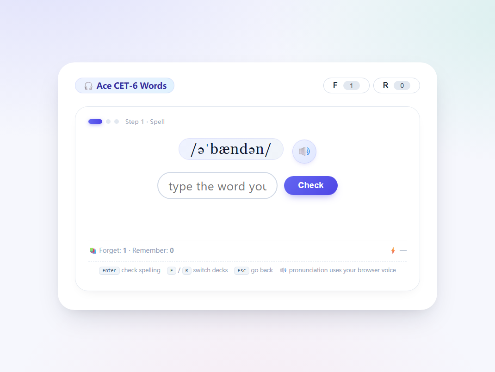
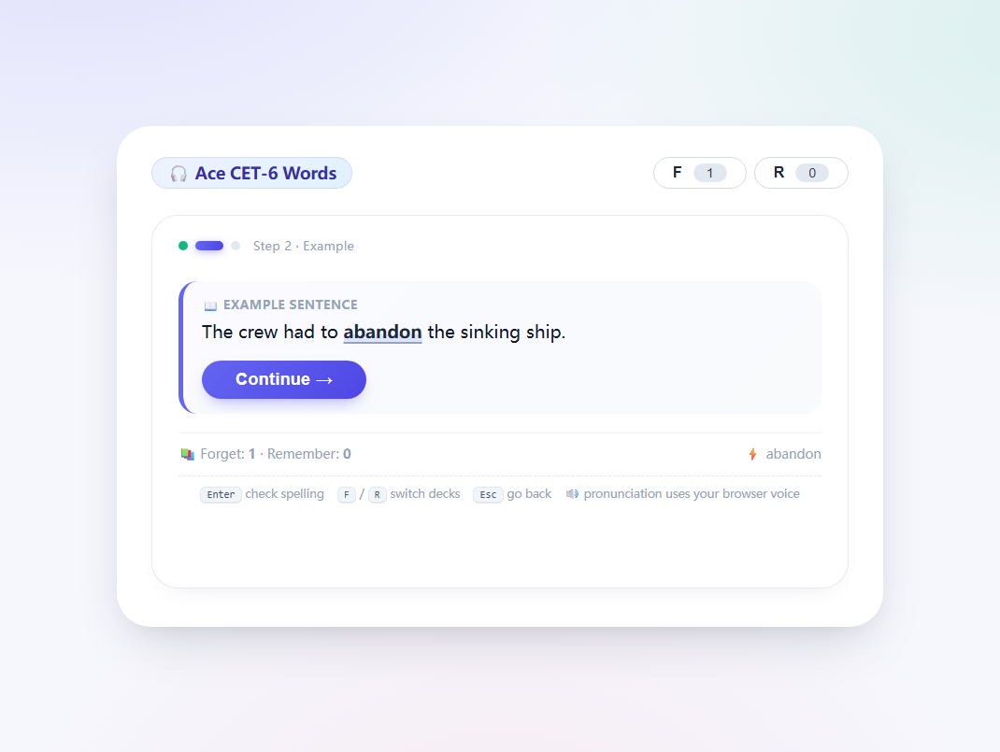
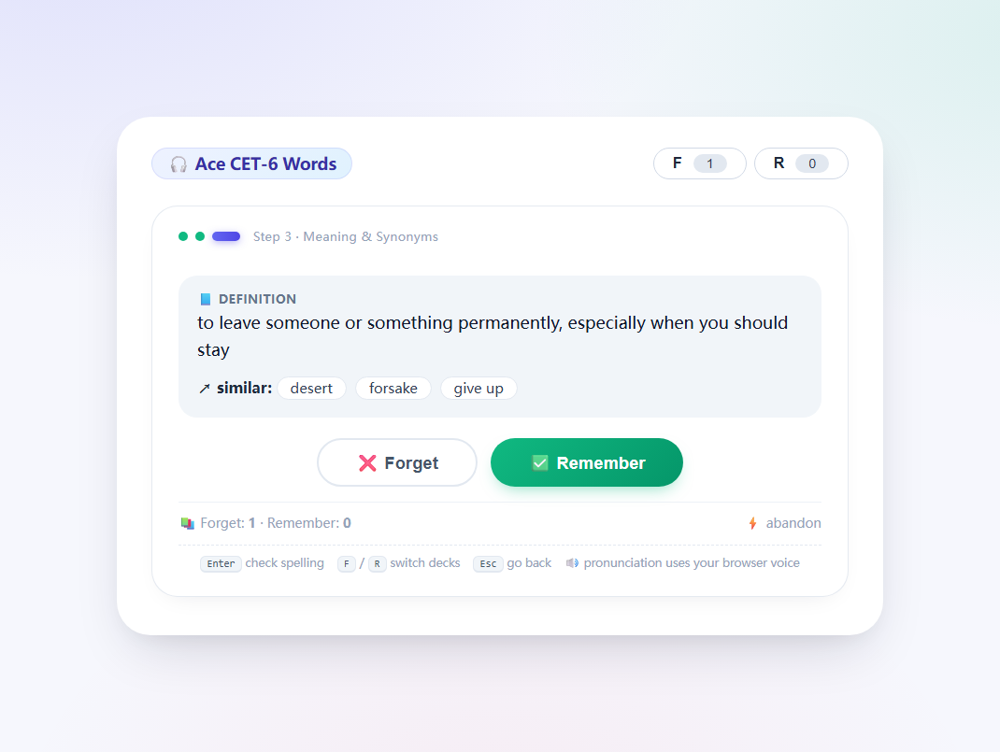
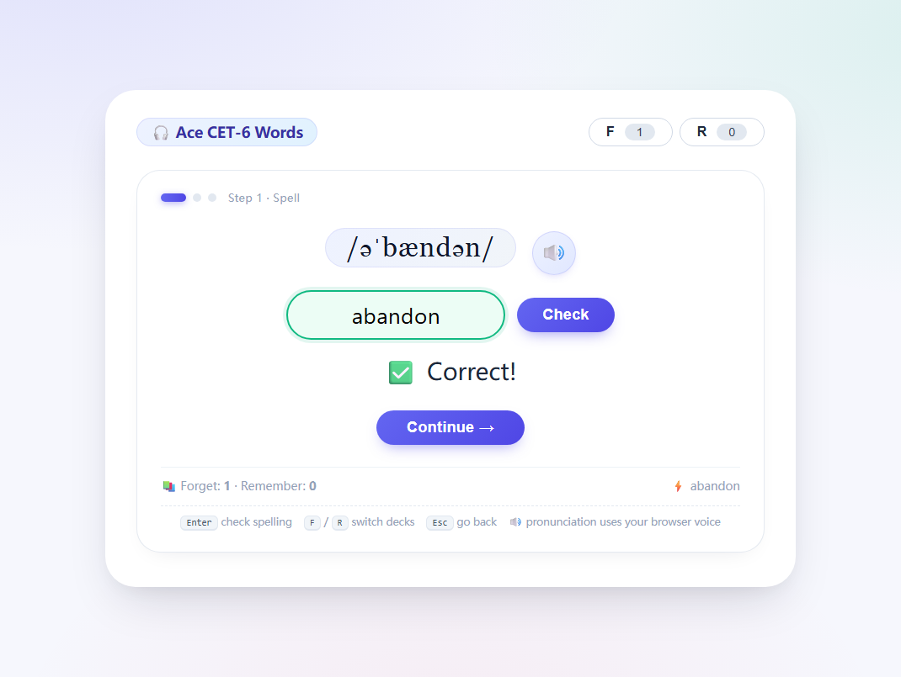
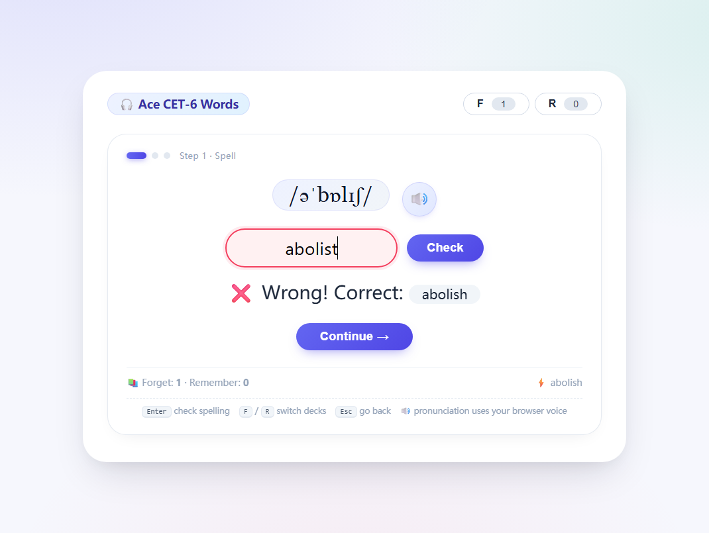
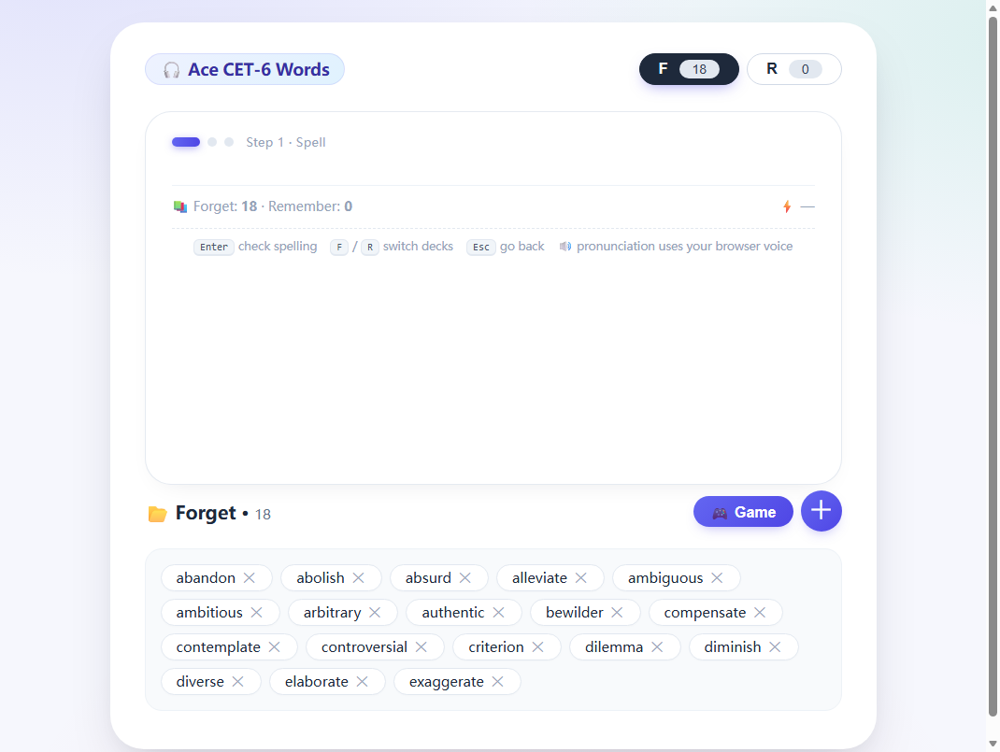
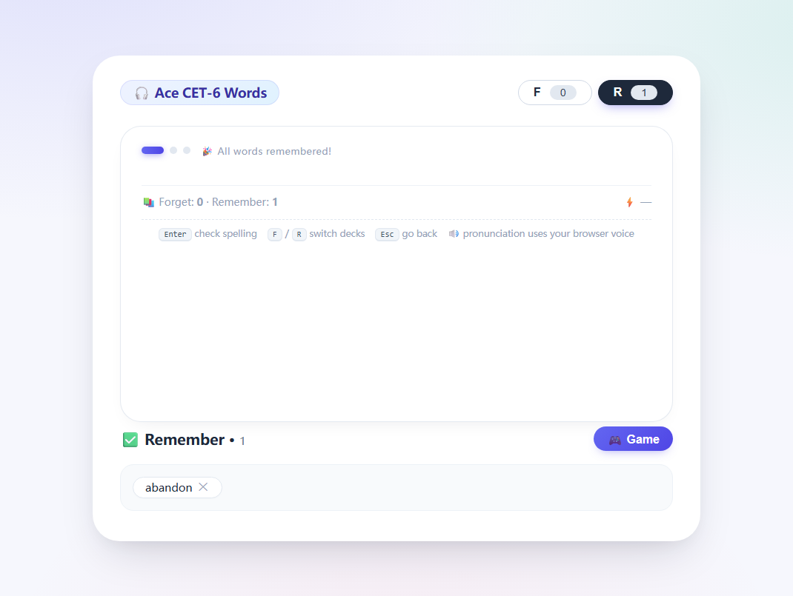
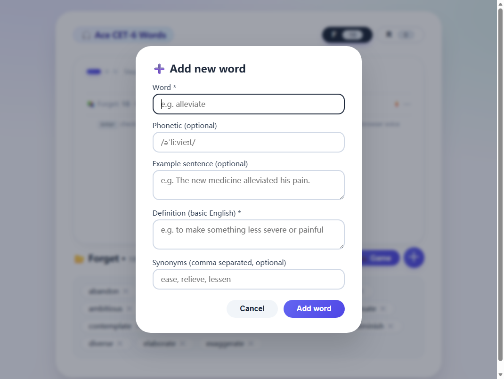

<div align="center">

# 🎧 Ace CET-6 Words
### 无痛全英背单词 · Learn English, in English — no Chinese crutches.

**Hear it → Spell it → Read it → Own it.**
听音默写 · 语境例句 · 英语释义,彻底告别"中译英"思维。

[](https://willow67967.github.io/Ace-CET-6-Words/)
[](https://github.com/willow67967/Ace-CET-6-Words/stargazers)
[](https://github.com/willow67967/Ace-CET-6-Words/forks)
[](https://github.com/willow67967/Ace-CET-6-Words/issues)
[](https://github.com/willow67967/Ace-CET-6-Words/commits/main)

**HTML5** · **Zero dependencies** · **No build step** · **Offline-first** · **Works on mobile** · **Made for CET-6 备考党**

</div>

---

> A **100% English-only** CET-6 vocabulary trainer. No Chinese definitions anywhere — every word is explained in simple English, so you build the habit of *thinking in English* instead of translating in your head.
>
> **一个"全英文"背单词的六级备考工具**。全程不出现中文释义,用基础英语解释单词,帮你直接建立英语思维,告别中译英的翻译腔。

## 📖 Why English-only? / 为什么要"英译英"?

When you learn `abandon = 放弃`, your brain stores a *translation*, and every time you read or hear the word you pay a "translation tax". When you learn `abandon = to leave someone or something permanently`, your brain connects the word to a **concept** — the same way you know your native language. This project deliberately hides Chinese so your brain has no shortcut but the real meaning. 🇬🇧

把 `abandon = 放弃` 换成 `abandon = to leave someone or something permanently`,你的大脑记住的是一个**概念**而非一串汉字——这才是母语者的词汇组织方式。没有中文可看,大脑才会被迫用英语去理解英语。

## ✨ Features / 特性

| | |
|---|---|
| 🎧 **Listen & spell** — hear the pronunciation, write the word from memory | 🔁 **Forget / Remember decks** — a lightweight version of spaced repetition |
| 🧩 **Real sentence** — every word appears in a natural example sentence | ➕ **Add your own words** — grow your own personal deck anytime |
| 📘 **Simple-English definition + synonyms** — no translation needed | 💾 **Progress saved locally** — `localStorage`, zero accounts, zero tracking |
| ⚡ **Keyboard-first** — `Enter` check · `F`/`R` switch decks · `Esc` back | 📱 **Mobile friendly** — responsive, works offline as a single file |
| 🔤 **562 high-frequency CET-6 words** (A→Y), with phonetics & sentences | 🧠 **All-English philosophy** — the whole UI stays English on purpose |

## 🕹️ How it works / 三步学习法

Every round shows you **one word in three steps**. You only advance when *you* say so.

### Step 1 · Spell / 第一步:听音默写
You see **only the phonetic** (plus a 🔊 button). Type the word from memory — green ✅ or red ❌ feedback, then the answer is revealed.

<p align="center">
  
  <br><sub>Step 1: only the phonetic is shown — the answer stays hidden until you check.</sub>
</p>

### Step 2 · Example / 第二步:语境例句
A natural example sentence appears with the word highlighted — you meet the word in context, exactly how it will appear in the exam.

<p align="center">
  
</p>

### Step 3 · Meaning & synonyms / 第三步:英语释义
A **simple-English definition** and similar words cement the *concept* — then decide: did you learn it (**Remember**) or not yet (**Forget**)?

<p align="center">
  
  <br><sub>Correct / wrong / example / definition / decks — full flow demo below.</sub>
</p>

<p align="center">
  
  
  <br>
  
  <br>
</p>

> 💡 **Deck logic:** all words start in the **Forget** deck (`F`). Each round draws randomly from Forget. Click **Remember** (`✅`) and the word moves to your Remember deck (`R`) — press `F` / `R` anytime to browse a deck, and press `Esc` to return to practice. Words you add with the **＋** button go into Forget, too.

## 🚀 Quick start / 快速开始

**Option A — just try it:** enable GitHub Pages (one-time, 3 clicks) 👉 [github.com/willow67967/Ace-CET-6-Words/settings/pages](https://github.com/willow67967/Ace-CET-6-Words/settings/pages) → **Source: Deploy from a branch** → `main` / `(root)` → Save. Then open **<https://willow67967.github.io/Ace-CET-6-Words/>** 🎉

**Option B — run locally:**

```bash
# no dependencies, no install — just serve the folder
cd Ace-CET-6-Words
python3 -m http.server 8000     # then open http://localhost:8000
# or simply double-click index.html — it works from file:// too
```

## ⌨️ Keyboard shortcuts / 快捷键

| Key | Action |
|---|---|
| `Enter` | Check spelling / submit |
| `F` | Toggle **Forget** deck (skipped while typing) |
| `R` | Toggle **Remember** deck (skipped while typing) |
| `Esc` | Close modal / back to practice |
| `🔊` | Hear the word (uses your browser's built-in voice) |

## 🗂️ Project structure / 目录结构

```
Ace-CET-6-Words/
├── index.html            # the whole app: UI + logic + 562-word bank (single file!)
├── assets/screenshots/   # screenshots used in this README
└── cet6/                 # original material & sources used to build the word bank
    ├── 生成项目的提示词.txt              # the build prompt log
    ├── 效果图.docx                      # early UI sketches
    └── *.doc                            # CET-6 vocabulary reference lists
```

> 🎯 **Why one file?** Everything (styles, logic, word data) lives in `index.html` so it runs anywhere — GitHub Pages, a USB stick, an offline classroom PC. No frameworks, no CDN, no tracking.

## 🧠 Word bank & data / 词库说明

- **562 hand-curated high-frequency CET-6 words** (A→Y), each with: phonetic · example sentence · simple-English definition · synonyms.
- Entries were **AI-assisted then manually proofread**, and cross-checked against the CET-6 reference lists kept in [`cet6/`](cet6/).
- The app **never sends your data anywhere** — progress and custom words stay in your browser's `localStorage` (`vocab6_state`). To reset, just clear site data.
- Built-in words are provided **for personal study/education only**.

**To contribute a word:** find the `BASE_WORDS` array in `index.html` (search `// ---- X ----` letter groups) and follow the exact same JSON shape. Pull requests welcome!

## 🗺️ Roadmap ideas / 后续构想

- [ ] True spaced repetition (SRS) scheduler with review intervals
- [ ] Statistics: daily streak, accuracy, mastered-count charts
- [ ] Exam-frequency tags (真题词频) & topic sets (科技 / 经济 / 教育…)
- [ ] Export / import your deck as JSON
- [ ] PWA: installable + fully offline
- [ ] Dark mode 🌙

Ideas are welcome — open an [issue](https://github.com/willow67967/Ace-CET-6-Words/issues) or submit a PR!

## 🤝 Contributing / 参与贡献

1. Fork it and clone.
2. Test locally (`python3 -m http.server`) — the app is one file, easy to review.
3. To regenerate the screenshots above, drive `index.html` in a headless browser and save the PNGs to `assets/screenshots/` (the files here were captured at 1100×900).
4. Commit with a clear message and open a Pull Request. 💚

## 📄 License / 许可

No license has been chosen yet — all rights reserved by default. Want to reuse or remix it (e.g. for CET-4, IELTS, 考研词汇)? Open an [issue](https://github.com/willow67967/Ace-CET-6-Words/issues) and we can pick an open-source license together.

---

<div align="center">

**If this helps you study, please ⭐ star the repo and share it with a friend who is also preparing for CET-6. 觉得有用就点个 ⭐ 吧,也欢迎转发给一起备考六级的朋友!**

*Made with 🎧 and a deep hatred of rote translation.*

</div>
